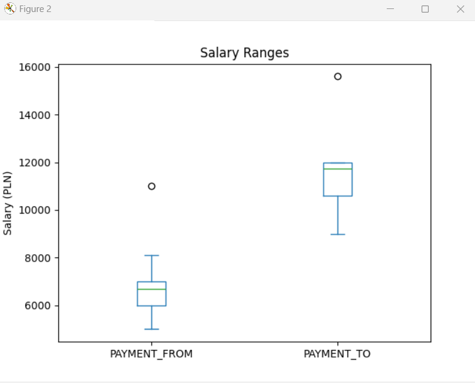

## Dokumentacja Projektowa: Job Webscrapper

### 1. Opis Projektu

Job Webscrapper to aplikacja, która automatycznie zbiera, analizuje i wizualizuje dane dotyczące ofert pracy. Program został zaprojektowany, aby pomóc użytkownikom w śledzeniu trendów na rynku pracy oraz w analizie wymaganych umiejętności i wynagrodzeń.

### 2. Architektura Systemu


### 3. Fragmenty Kodów z Objaśnieniami

#### 3.1 Plik: main.py

```python
# main.py
import os
import tkinter as tk
from tkinter import filedialog, messagebox
import pandas as pd
import data_processing as dp
import visualization as vz
import whole

# Zdefiniowanie URL dla różnych typów ofert
urls = {
    "JavaScript": "https://justjoin.it/all-locations/javascript",
    "HTML": "https://justjoin.it/all-locations/html",
    ...
}
```
**Objaśnienia:**

- `urls`: Słownik zawierający adresy URL do różnych typów ofert pracy. Dzięki temu można łatwo zdefiniować i zarządzać różnymi kategoriami ofert.

```python
# Ustawienia katalogu roboczego
working_dir = ""
current_skills = []

def load_skills(file_path: str) -> None:
    """
    Load skills from a file and update the global current_skills list.

    Parameters
    ----------
    file_path : str
        Path to the file containing skills.
    """
    global current_skills
    with open(file_path, "r") as file:
        current_skills = [line.strip() for line in file.readlines()]
    messagebox.showinfo("Info", "Skills loaded successfully.")
```

**Objaśnienia:**

- `load_skills()`: Funkcja ładuje umiejętności z pliku i aktualizuje globalną listę `current_skills`. Plik z umiejętnościami powinien zawierać jedną umiejętność na linię.

```python
def analyze_data(df: pd.DataFrame) -> None:
    """
    Perform data analysis on the given DataFrame.

    Parameters
    ----------
    df : pd.DataFrame
        DataFrame containing job data.
    """
    model_from, model_to = vz.analyze_data(df)
    messagebox.showinfo("Info", "Data analysis completed.")
```

**Objaśnienia:**

- `analyze_data()`: Funkcja analizuje dane z DataFrame, wywołując funkcję `analyze_data` z modułu `visualization`. Po zakończeniu analizy wyświetla komunikat o jej zakończeniu.

```python
def visualize_data(df: pd.DataFrame) -> None:
    """
    Visualize data from the given DataFrame.

    Parameters
    ----------
    df : pd.DataFrame
        DataFrame containing job data.
    """
    most_common_skills, high_salary_skills = vz.visualize_data(df)
    most_common_skills_str = most_common_skills.to_string()
    high_salary_skills_str = high_salary_skills.to_string()

    messagebox.showinfo("Most Common Skills", most_common_skills_str)
    messagebox.showinfo("High Salary Skills", high_salary_skills_str)
    messagebox.showinfo("Info", "Data visualization completed.")
```

**Objaśnienia:**

- `visualize_data()`: Funkcja wizualizuje dane z DataFrame, wywołując funkcję `visualize_data` z modułu `visualization`. Następnie wyświetla wyniki najczęściej występujących i najwyżej płatnych umiejętności.

```python
class App(tk.Tk):
    def __init__(self) -> None:
        """
        Initialize the App window.
        """
        super().__init__()
        self.title("Job Scraper")
        self.geometry("540x220")
        self.url_var = tk.StringVar(self)
        self.url_var.set(next(iter(urls)))
        self.experience_level_var = tk.StringVar(self)
        self.experience_level_var.set("junior")
        self.remote_var = tk.BooleanVar(self)
        self.create_widgets()
```

**Objaśnienia:**

- `App`: Klasa definiująca główne okno aplikacji z widgetami Tkinter. Ustawia podstawowe parametry okna, takie jak tytuł i rozmiar, oraz inicjuje zmienne dla typów ofert pracy, poziomu doświadczenia i opcji pracy zdalnej.

```python
    def create_widgets(self) -> None:
        """
        Create and arrange widgets in the app window.
        """
        tk.Label(self, text="Select Job Type", width=20).grid(
            row=0, column=0, padx=10, pady=5
        )
        tk.OptionMenu(self, self.url_var, *urls.keys()).grid(
            row=1, column=0, padx=10, pady=5, sticky="ew"
        )
        ...
        whole_analysis_button = tk.Button(
            self,
            text="Cala analiza",
            command=self.run_whole_analysis,
            bg="lightcoral",
            width=20,
        )
        whole_analysis_button.grid(row=2, column=2, padx=10, pady=5)
```

**Objaśnienia:**

- `create_widgets()`: Funkcja tworzy i rozmieszcza widgety w oknie aplikacji. Zawiera etykiety, menu rozwijane, przyciski do ustawienia katalogu roboczego, ładowania umiejętności, zbierania ofert pracy, analizy danych oraz wizualizacji danych.

#### 3.2 Plik: data_processing.py

```python
# data_processing.py

import os
import pandas as pd
import datetime
import shutil
import docx
from docx.shared import Pt
import requests
from bs4 import BeautifulSoup
import json
from typing import List
```

**Objaśnienia:**

- Importowane moduły obejmują biblioteki do manipulacji plikami, przetwarzania danych, tworzenia dokumentów, wykonywania żądań HTTP oraz parsowania HTML.

```python
def create_working_dir(working_dir: str, name: str) -> str:
    """
    Create a working directory with a timestamp and sanitized name.

    Parameters
    ----------
    working_dir : str
        The base directory where the new directory will be created.
    name : str
        The name to be sanitized and included in the directory name.

    Returns
    -------
    str
        The path to the newly created directory.
    """
    date = (
        str(datetime.datetime.now())
        .split(".")[0]
        .replace(" ", "_")
        .replace("-", "_")
        .replace(":", "_")
    )
    name = (
        name.replace("-", "_")
        .replace(":", "_")
        .replace("(", "_")
        .replace(")", "_")
    )
    dir_name = os.path.join(working_dir, f"{date}_{name}")
    if not os.path.exists(dir_name):
        os.mkdir(dir_name)
    return dir_name
```

**Objaśnienia:**

- `create_working_dir()`: Funkcja tworzy katalog roboczy z bieżącą datą i godziną oraz z podaną nazwą, która jest sanitizowana, aby usunąć nieprawidłowe znaki.

```python
def sanitize_filename(filename: str) -> str:
    """
    Sanitize a filename by replacing or removing invalid characters.

    Parameters
    ----------
    filename : str
        The filename to sanitize.

    Returns
    -------
    str
        The sanitized filename.
    """
    return (
        filename.replace(" ", "_")
        .replace("-", "_")
        .replace("/", "_")
        .replace("\\", "_")
        .replace("*", "")
        .replace("|", "")
        .replace(":", "")
        .replace("?", "")
        .replace("<", "")
        .replace(">", "")
        .replace(":", "_")
        .replace("(", "_")
        .replace(")", "_")
    )
```

**Objaśnienia:**

- `sanitize_filename()`: Funkcja sanitizuje nazwę pliku poprzez zamianę lub usunięcie nieprawidłowych znaków, co zapobiega błędom związanym z nazwami plików.

```python
def word_cv_prepare(
    working_dir: str, dir: str, skills: List[str], position: str,
    current_skills: List[str]
) -> None:
    """
    Prepare and save a CV document in a specified directory.

    Parameters
    ----------
    working_dir : str
        The base working directory.
    dir : str
        The directory where the CV will be saved.
    skills : List[str]
        List of skills to include in the CV.
    position : str
        The job position to include in the CV.
    current_skills : List[str]
        List of current skills to include in the CV.
    """
    all_skills = list(set(current_skills + skills))
    all_skills.sort(key=str.lower)

    source = os.path.join(working_dir, "PT

.docx")
    if not os.path.exists(source):
        print(f"Source CV file not found: {source}")
        return

    destination = os.path.join(dir, "PrzemyslawTuturCV.docx")
    shutil.copy(source, destination)
    doc_name_position = sanitize_filename(position)
    doc = docx.Document(destination)
    paragraph = doc.add_paragraph(", ".join(all_skills).upper())
    run = paragraph.runs[0]
    run.font.name = "Times New Roman"

    section = doc.sections[0]
    footer = section.footer
    footer_para = footer.paragraphs[0]
    footer_para_run = footer_para.add_run(
        f"This CV document was automatically generated and submitted for the "
        f"{position} position based on skill matching. If you contact me with "
        f"a response, I might be momentarily confused :)... Apologies for the "
        f"Monty Python 'spam, spam, spam' scenario if you have received "
        f"multiple CVs."
    )
    footer_para_run.font.name = "Times New Roman"
    footer_para_run.font.bold = True
    footer_para_run.font.size = Pt(10)

    try:
        doc.save(os.path.join(dir, f"Przemyslaw_Tutur_{doc_name_position}.docx"))
    except OSError as e:
        print(f"Error saving document: {e}")
```

**Objaśnienia:**

- `word_cv_prepare()`: Funkcja przygotowuje i zapisuje dokument CV w określonym katalogu. Łączy umiejętności z listy bieżących i wymaganych, kopiuje szablon CV, aktualizuje treść dokumentu i dodaje stopkę z informacją.

```python
def generate_cover_letter(
    working_dir: str, job_title: str, company_name: str, job_url: str
) -> None:
    """
    Generate and save a cover letter for a job application.

    Parameters
    ----------
    working_dir : str
        The base working directory.
    job_title : str
        The job title to include in the cover letter.
    company_name : str
        The company name to include in the cover letter.
    job_url : str
        The job URL to include in the cover letter.
    """
    doc = docx.Document()
    doc.add_heading("Cover Letter", 0)
    doc.add_paragraph(f"Date: {datetime.datetime.now().strftime('%Y-%m-%d')}")
    doc.add_paragraph("Dear Hiring Manager,")
    doc.add_paragraph(
        f"I am writing to express my interest in the {job_title} position at "
        f"{company_name}. I found this job listing on {job_url} and believe "
        f"that my skills and experience make me a strong candidate for this "
        f"role."
    )
    doc.add_paragraph(
        "I have extensive experience in the required skills mentioned in the "
        "job description, including [mention some key skills]. I am confident "
        "that my background and knowledge will enable me to contribute "
        "effectively to your team."
    )
    doc.add_paragraph(
        "I look forward to the opportunity to discuss how my skills and "
        "experiences align with the needs of your team. Thank you for "
        "considering my application."
    )
    doc.add_paragraph("Sincerely,")
    doc.add_paragraph("[Your Name]")

    cover_letter_path = os.path.join(
        working_dir, f"Cover_Letter_{sanitize_filename(job_title)}.docx"
    )
    doc.save(cover_letter_path)
    print(f"Cover letter saved to {cover_letter_path}")
```

**Objaśnienia:**

- `generate_cover_letter()`: Funkcja generuje i zapisuje list motywacyjny dla aplikacji na wybrane stanowisko. Tworzy nowy dokument, dodaje nagłówki i treść, a następnie zapisuje go w katalogu roboczym.

```python
def take_job_description(dir: str, url: str) -> None:
    """
    Retrieve and save the job description from a given URL.

    Parameters
    ----------
    dir : str
        The directory where the job description will be saved.
    url : str
        The URL of the job description.
    """
    try:
        resp = requests.get(url)
        soup = BeautifulSoup(resp.text, "html.parser")
        target_div_content = soup.find("div", class_="css-6sm4q6")
        if target_div_content:
            with open(
                os.path.join(dir, "job_description.txt"), "w", encoding="utf-8"
            ) as fdescriptor:
                fdescriptor.write(target_div_content.text)
        else:
            print("The specified div was not found.")
    except Exception as e:
        print(f"Error taking job description: {e}")
```

**Objaśnienia:**

- `take_job_description()`: Funkcja pobiera i zapisuje opis pracy z podanego URL. Wykorzystuje `BeautifulSoup` do parsowania HTML i zapisuje zawartość wybranego elementu do pliku tekstowego.

```python
def request(
    working_dir: str, current_skills: List[str], url: str
) -> pd.DataFrame:
    """
    Send a request to a job listing URL, process the data, and save it.

    Parameters
    ----------
    working_dir : str
        The base working directory.
    current_skills : List[str]
        List of current skills to match against job listings.
    url : str
        The URL of the job listings.

    Returns
    -------
    pd.DataFrame
        DataFrame containing the processed job data.
    """
    try:
        # Clear the current output data CSV file
        file_path = os.path.join(working_dir, "output_data.csv")
        if os.path.exists(file_path):
            os.remove(file_path)

        resp = requests.get(url)
        int_resp = requests.get(url)
        json_string = str(
            int_resp.text.split('{"pages":')[1].split('"meta":')[0].rstrip(",")
            + "}]"
        )
        data_set = json.loads(json_string)
        data_list = []
        for data in data_set[0]["data"]:
            sub_url = "https://justjoin.it/offers/" + data["slug"]
            row = {
                "TITLE": data["title"],
                "REQUIRED_SKILLS": str(data["requiredSkills"]),
                "ADDITIONAL_SKILLS": str(data["niceToHaveSkills"]),
                "WORKPLACE_TYPE": data["workplaceType"],
                "REMOTE_INTERVIEW": data["remoteInterview"],
                "URL": sub_url,
                "PAYMENT_FROM": str(data["employmentTypes"][0]["fromPln"]),
                "PAYMENT_TO": str(data["employmentTypes"][0]["toPln"]),
                "LOCATION": data.get("city", "Unknown"),
                "COMPANY": data.get("companyName", "Unknown"),
                "DATE": datetime.datetime.now().strftime("%Y-%m-%d"),
            }
            data_list.append(row)
            directory = create_working_dir(working_dir, data["slug"])
            take_job_description(directory, sub_url)
            word_cv_prepare(
                working_dir,
                directory,
                data["requiredSkills"],
                data["title"],
                current_skills,
            )
            generate_cover_letter(
                directory,
                data["title"],
                data.get("companyName", "Unknown"),
                sub_url,
            )
            print("Processed:", data["title"])
        df = pd.DataFrame(data_list)
        write_header = not os.path.exists(file_path)
        df.to_csv(file_path, mode="a", index=False, header=write_header)

        # Append to the output_whole.csv
        whole_file_path = os.path.join(working_dir, "output_whole.csv")
        df.to_csv(
            whole_file_path, mode="a", index=False,
            header=not os.path.exists(whole_file_path)
        )

        print("Data appended to CSV.")
        return df
    except Exception as e:
        print(f"Error processing request: {e}")
        return pd.DataFrame()  # Return empty DataFrame on error
```

**Objaśnienia:**

- `request()`: Funkcja wysyła żądanie do podanego URL z ofertami pracy, przetwarza dane i zapisuje je do pliku CSV. Pobiera również szczegóły każdej oferty pracy, takie jak opis pracy, tworzy dokumenty CV i listy motywacyjne.

#### 3.3 Plik: visualization.py

```python
# visualization.py
import pandas as pd
import matplotlib.pyplot as plt
from sklearn.linear_model import LinearRegression
import numpy as np
from sklearn.cluster import KMeans
import mermaid
from typing import Tuple
```

**Objaśnienia:**

- Importowane moduły obejmują biblioteki do przetwarzania danych, tworzenia wykresów, regresji liniowej, klastrowania oraz używania mermaid do wizualizacji logiki.

```python
def analyze_data(df: pd.DataFrame) -> Tuple[LinearRegression, LinearRegression]:
    """
    Analyze data to fit linear regression models.

    Parameters
    ----------
    df : pd.DataFrame
        DataFrame containing job data.

    Returns
    -------
    Tuple[LinearRegression, LinearRegression]
        Fitted linear regression models for payment from and to.
    """
    df["REQUIRED_SKILLS_LEN"] = df["REQUIRED_SKILLS"].apply(
        lambda x: len(eval(x)) if isinstance(x, str) else 0
    )
    df["ADDITIONAL

_SKILLS_LEN"] = df["ADDITIONAL_SKILLS"].apply(
        lambda x: len(eval(x)) if isinstance(x, str) and x != "None" else 0
    )
    X = df[["REQUIRED_SKILLS_LEN", "ADDITIONAL_SKILLS_LEN"]].fillna(0)
    y_from = df["PAYMENT_FROM"].astype(float).fillna(
        df["PAYMENT_FROM"].astype(float).median()
    )
    y_to = df["PAYMENT_TO"].astype(float).fillna(
        df["PAYMENT_TO"].astype(float).median()
    )

    model_from = LinearRegression()
    model_to = LinearRegression()
    model_from.fit(X, y_from)
    model_to.fit(X, y_to)

    return model_from, model_to
```

**Objaśnienia:**

- `analyze_data()`: Funkcja analizuje dane z DataFrame, dopasowując modele regresji liniowej dla wynagrodzeń. Oblicza długość wymaganych i dodatkowych umiejętności, a następnie dopasowuje modele do danych.

```python
def visualize_data(df: pd.DataFrame) -> Tuple[pd.Series, pd.Series]:
    """
    Visualize data from the DataFrame.

    Parameters
    ----------
    df : pd.DataFrame
        DataFrame containing job data.

    Returns
    -------
    Tuple[pd.Series, pd.Series]
        Most common skills and high salary skills.
    """
    most_common_skills, high_salary_skills = analyze_most_desirable_skills(df)
    plot_required_skills_pie_chart(df)
    plot_salary_ranges(df)
    plot_job_locations(df)
    plot_salary_trends(df)
    cluster_job_offers(df)
    return most_common_skills, high_salary_skills
```

**Objaśnienia:**

- `visualize_data()`: Funkcja wizualizuje dane z DataFrame, tworząc różne wykresy, takie jak wykres kołowy wymaganych umiejętności, wykresy zakresu wynagrodzeń, lokalizacji ofert pracy, trendów wynagrodzeń oraz klastrów ofert pracy.

```python
def plot_required_skills_pie_chart(
    df: pd.DataFrame, ax: plt.Axes = None, job_type: str = None
) -> None:
    """
    Plot a pie chart of the required skills distribution.

    Parameters
    ----------
    df : pd.DataFrame
        DataFrame containing job data.
    ax : plt.Axes, optional
        Matplotlib axes object to draw the plot onto.
    job_type : str, optional
        Job type for the title.
    """
    skills = df["REQUIRED_SKILLS"].apply(lambda x: eval(x) if isinstance(x, str) else [])
    if skills.apply(len).sum() == 0:
        return  # Skip plotting if there are no skills to plot
    skills_counts = pd.Series(np.concatenate(skills.values)).value_counts()
    skills_counts.head(20).plot(kind="pie", autopct="%1.1f%%", ax=ax)
    if ax:
        ax.set_title(f"Required Skills Distribution - {job_type}")
        ax.set_ylabel("")  # Remove y-axis label
    else:
        plt.title("Required Skills Distribution")
        plt.ylabel("")  # Remove y-axis label
        plt.show()
```

**Objaśnienia:**

- `plot_required_skills_pie_chart()`: Funkcja tworzy wykres kołowy przedstawiający rozkład wymaganych umiejętności. Jeśli nie ma żadnych umiejętności do wykazania, wykres nie zostanie narysowany.

```python
def plot_salary_ranges(df: pd.DataFrame) -> None:
    """
    Plot box plots of salary ranges.

    Parameters
    ----------
    df : pd.DataFrame
        DataFrame containing job data.
    """
    plt.figure(figsize=(6, 4))
    df[["PAYMENT_FROM", "PAYMENT_TO"]].astype(float).plot(kind="box")
    plt.title("Salary Ranges")
    plt.ylabel("Salary (PLN)")
    plt.show()
```

**Objaśnienia:**

- `plot_salary_ranges()`: Funkcja tworzy wykresy pudełkowe przedstawiające zakresy wynagrodzeń z danych w DataFrame. Dzięki temu można łatwo zobaczyć rozkład wynagrodzeń.

```python
def analyze_most_desirable_skills(
    df: pd.DataFrame
) -> Tuple[pd.Series, pd.Series]:
    """
    Analyze and return the most desirable skills and high salary skills.

    Parameters
    ----------
    df : pd.DataFrame
        DataFrame containing job data.

    Returns
    -------
    Tuple[pd.Series, pd.Series]
        Most common skills and high salary skills.
    """
    skills = df["REQUIRED_SKILLS"].apply(lambda x: eval(x) if isinstance(x, str) else [])
    if skills.apply(len).sum() == 0:
        return pd.Series(dtype="int"), pd.Series(dtype="int")
    skills_counts = pd.Series(np.concatenate(skills.values)).value_counts()
    high_salary_skills = pd.Series(
        np.concatenate(
            df[df["PAYMENT_TO"].astype(float) > df["PAYMENT_TO"].astype(float).quantile(0.75)][
                "REQUIRED_SKILLS"
            ].apply(lambda x: eval(x) if isinstance(x, str) else []).values
        )
    ).value_counts()

    return skills_counts.head(20), high_salary_skills.head(20)
```

**Objaśnienia:**

- `analyze_most_desirable_skills()`: Funkcja analizuje i zwraca najczęściej wymagane umiejętności oraz umiejętności, które są związane z wysokimi wynagrodzeniami. Przetwarza dane w DataFrame, aby uzyskać te informacje.

#### 3.4 Plik: whole.py

```python
# whole.py
import os
import requests
import json
import datetime
import pandas as pd
from visualization import (
    visualize_data,
    analyze_job_types,
    analyze_skill_salary_relationship,
)
from main import urls  # Import URLs from main.py
```

**Objaśnienia:**

- Importowane moduły obejmują biblioteki do przetwarzania danych, wysyłania żądań HTTP oraz funkcje wizualizacji z modułu `visualization`.

```python
def request(working_dir: str, current_skills: list, url: str) -> pd.DataFrame:
    """
    Request job data from a given URL and save it to a CSV file.

    Parameters
    ----------
    working_dir : str
        The working directory to save the data.
    current_skills : list
        List of current skills to include in the request.
    url : str
        The URL to request job data from.

    Returns
    -------
    pd.DataFrame
        DataFrame containing the job data.
    """
    try:
        file_path = os.path.join(working_dir, "output_data.csv")
        if os.path.exists(file_path):
            os.remove(file_path)

        resp = requests.get(url)
        if resp.status_code == 200:
            json_string = str(
                resp.text.split('{"pages":')[1].split('"meta":')[0].rstrip(",")
                + "}]"
            )
            data_set = json.loads(json_string)
            data_list = []
            for data in data_set[0]["data"]:
                sub_url = "https://justjoin.it/offers/" + data["slug"]
                required_skills = data.get("requiredSkills", [])
                additional_skills = data.get("niceToHaveSkills", [])
                employment_info = (
                    data["employmentTypes"][0] if data["employmentTypes"] else {}
                )

                row = {
                    "TITLE": data.get("title", ""),
                    "REQUIRED_SKILLS": str(required_skills),
                    "ADDITIONAL_SKILLS": str(additional_skills),
                    "WORKPLACE_TYPE": data.get("workplaceType", ""),
                    "REMOTE_INTERVIEW": data.get("remoteInterview", ""),
                    "URL": sub_url,
                    "PAYMENT_FROM": str(employment_info.get("fromPln", "")),
                    "PAYMENT_TO": str(employment_info.get("toPln", "")),
                    "LOCATION": data.get("city", "Unknown"),
                    "COMPANY": data.get("companyName", "Unknown"),
                    "DATE": datetime.datetime.now().strftime("%Y-%m-%d"),
                }
                data_list.append(row)
                print("Processed:", data["title"])
            df = pd.DataFrame(data_list)
            write_header = not os.path.exists(file_path)
            df.to_csv(file_path, mode="a", index=False, header=write_header)

            whole_file_path = os.path.join(working_dir, "output_whole.csv")
            df.to_csv(
                whole_file_path,
                mode="a",
                index=False,
                header=not os.path.exists(whole_file_path),
            )

            print("Data appended to CSV.")
            return df
        else:
            print(f"Failed to fetch data for {url}: HTTP {resp.status_code}")
            return pd.DataFrame()
    except Exception as e:
        print(f"Error processing request: {e}")
        return pd.DataFrame()
```

**Objaśnienia:**

- `request()`: Funkcja wysyła żądanie do podanego URL, przetwarza dane ofert pracy i zapisuje je do pliku CSV. Jeśli żądanie zakończy się niepowodzeniem, funkcja zwraca pusty DataFrame.

```python
def fetch_job_data

(working_dir: str, current_skills: list) -> list:
    """
    Fetch job data for all job types from URLs.

    Parameters
    ----------
    working_dir : str
        The working directory to save the data.
    current_skills : list
        List of current skills to include in the request.

    Returns
    -------
    list
        List of dictionaries containing job data.
    """
    all_data = []
    for job_type, url in urls.items():
        print(f"Fetching data for {job_type} from {url}")
        data = request(working_dir, current_skills, url)
        if not data.empty:
            data["JOB_TYPE"] = job_type
            all_data.extend(data.to_dict("records"))
    return all_data
```

**Objaśnienia:**

- `fetch_job_data()`: Funkcja pobiera dane ofert pracy dla wszystkich typów ofert z URL-i zdefiniowanych w `urls`. Dla każdej kategorii wywołuje funkcję `request()` i zbiera dane w postaci listy słowników.

```python
def save_to_csv(data: list, file_path: str) -> None:
    """
    Save job data to a CSV file.

    Parameters
    ----------
    data : list
        List of dictionaries containing job data.
    file_path : str
        Path to the CSV file to save the data.
    """
    df = pd.DataFrame(data)
    if not df.empty:
        df.columns = [col.strip() for col in df.columns]
        if os.path.exists(file_path):
            existing_df = pd.read_csv(file_path)
            combined_df = pd.concat([existing_df, df]).drop_duplicates(
                subset=["TITLE", "PAYMENT_FROM", "PAYMENT_TO"]
            )
        else:
            combined_df = df.drop_duplicates(
                subset=["TITLE", "PAYMENT_FROM", "PAYMENT_TO"]
            )
        required_columns = [
            "TITLE",
            "REQUIRED_SKILLS",
            "ADDITIONAL_SKILLS",
            "WORKPLACE_TYPE",
            "REMOTE_INTERVIEW",
            "URL",
            "PAYMENT_FROM",
            "PAYMENT_TO",
            "LOCATION",
            "COMPANY",
            "DATE",
            "JOB_TYPE",
        ]
        for col in required_columns:
            if col not in combined_df.columns:
                combined_df[col] = ""
        combined_df = combined_df[required_columns]
        combined_df.to_csv(file_path, index=False)
    else:
        print("No data to save.")
```

**Objaśnienia:**

- `save_to_csv()`: Funkcja zapisuje dane ofert pracy do pliku CSV. Jeśli plik już istnieje, dodaje nowe dane, usuwając duplikaty. Zapewnia, że wszystkie wymagane kolumny są obecne w DataFrame.

```python
def analyze_and_visualize(file_path: str) -> None:
    """
    Analyze and visualize job data from a CSV file.

    Parameters
    ----------
    file_path : str
        Path to the CSV file containing job data.
    """
    if os.path.exists(file_path):
        df = pd.read_csv(file_path)
        visualize_data(df)
        analyze_job_types(df)
        analyze_skill_salary_relationship(df)
    else:
        print(f"No file found at {file_path} to analyze and visualize.")
```

**Objaśnienia:**

- `analyze_and_visualize()`: Funkcja analizuje i wizualizuje dane ofert pracy z pliku CSV. Wywołuje funkcje do wizualizacji danych, analizy typów ofert pracy oraz analizy zależności między umiejętnościami a wynagrodzeniami.

```python
def main() -> None:
    """
    Main function to fetch, save, analyze, and visualize job data.
    """
    working_dir = os.getcwd()
    current_skills = []  # Load current skills from the file or user input if necessary
    file_path = os.path.join(working_dir, "output_whole.csv")
    all_data = fetch_job_data(working_dir, current_skills)
    save_to_csv(all_data, file_path)
    analyze_and_visualize(file_path)

if __name__ == "__main__":
    main()
```

**Objaśnienia:**

- `main()`: Główna funkcja programu. Pobiera bieżący katalog roboczy, ładuje aktualne umiejętności (jeśli są dostępne), pobiera dane ofert pracy, zapisuje je do pliku CSV oraz analizuje i wizualizuje te dane.

### 4. Miejsce na Screenshoty





### 5. Wyjaśnienie Użycia Przycisków

- **Set Working Directory**: Ustawia katalog roboczy, w którym zapisywane będą dane z ofert pracy.
- **Load Skills**: Ładuje listę umiejętności z wybranego pliku.
- **Scrape Jobs**: Zbiera oferty pracy na podstawie wybranych kryteriów i zapisuje dane.
- **Analyze Data**: Analizuje zebrane dane.
- **Visualize Data**: Wizualizuje zebrane dane.
- **Cala analiza**: Uruchamia pełną analizę danych.

### 6. Wyjaśnienia z Wzorami Matematycznymi

#### 6.1 Analiza Danych

W module `visualization.py` znajdują się funkcje do analizy danych, w tym regresji liniowej i klastrowania K-średnich.

**Regresja Liniowa**

## Regresja Liniowa

Model regresji liniowej jest dopasowywany do danych przy użyciu następujących wzorów:

$$
y = \beta_0 + \beta_1 x_1 + \beta_2 x_2 + \ldots + \beta_n x_n
$$

gdzie:
- $\( y \)$ to zmienna zależna (np. wynagrodzenie),
- $\( \beta_0, \beta_1, \ldots, \beta_n \)$ to współczynniki modelu,
- $\( x_1, x_2, \ldots, x_n \)$ to zmienne niezależne (np. liczba wymaganych umiejętności).

## Klastrowanie K-średnich

Klastrowanie K-średnich polega na minimalizacji sumy kwadratów odległości między punktami a najbliższym centroidem:

```latex
\text{argmin}_S \sum_{i=1}^{k} \sum_{x \in S_i} \| x - \mu_i \|^2
```

gdzie:
- $\( k \)$ to liczba klastrów,
- $\( S_i \)$ to zbiór punktów przypisanych do klastra $\( i \)$,
- $\( \mu_i \)$ to centroid klastra $\( i \)$.

### 7. Podsumowanie

Job Webscrapper to kompleksowe narzędzie do zbierania, analizowania i wizualizacji danych z rynku pracy. Aplikacja pozwala użytkownikom na bieżąco śledzić trendy i analizować wymagania rynkowe.
